# Jason Zhang

JHEDID: jzhan127

Environment:

​	Microsoft C++ compiler

​	Visual Studio 2017

​	Windows

Late Days Used: 0

# Methods

## AddRandomNoise

-This function adds random noise to the input image by taking in a noise value input and generating a random number from -noise to noise and then scaling that value and adding it to a pixel(added individually to each color channel)

| 0                                   | 0.1                                   | 0.5                                   |
| ----------------------------------- | ------------------------------------- | ------------------------------------- |
|  | 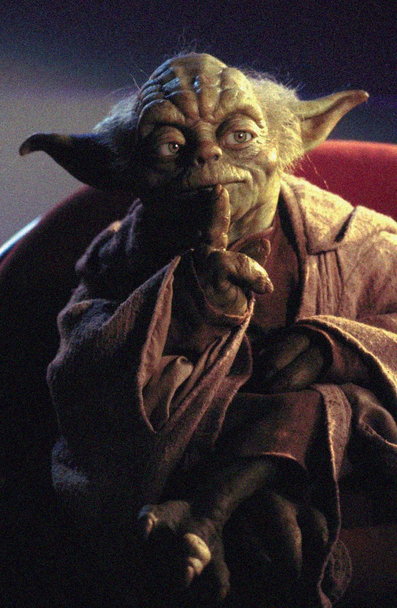 |  |

## Brighten

-This function changes brightness of an image by a factor of the inputted brightness value. Each color channel of each pixel is multiplied by this brightness constant.

| 0.5                                    | 1                                    | 2                                    |
| -------------------------------------- | ------------------------------------ | ------------------------------------ |
|  |  |  |

## Luminance

-This function calculates the luminance value of each pixel and sets each color channel of that pixel to the luminance value.

| Gray                             |
| -------------------------------- |
|  |

## Contrast

-This function adjusts the contrast by an input value by calculating the mean image luminance and then scaling each pixel's deviation from the mean luminance by the input value(done for every color channel).

| 0.5                                       | 1                                       | 2                                       |
| ----------------------------------------- | --------------------------------------- | --------------------------------------- |
| 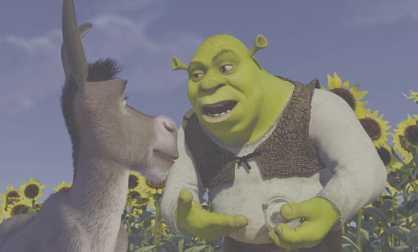 |  |  |

## Saturate

-This function adjusts the saturation by an input value by first calculating the per pixel luminance and then scaling each pixel's deviation from the luminance by the input value(done for every color channel).

| 0.5                                       | 1                                       | 2                                       |
| ----------------------------------------- | --------------------------------------- | --------------------------------------- |
|  |  | 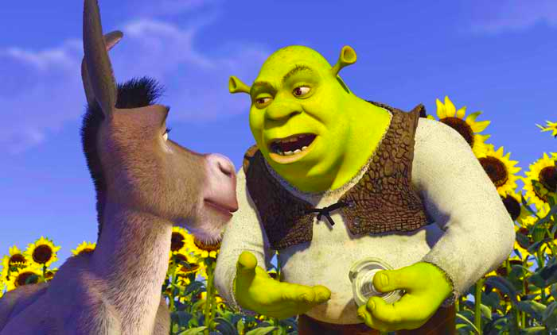 |

## Crop

-This function crops an input image by taking in the coordinates of the top left corner of where to start the cropping and the bottom right corner of where to end the crop and then iterating through those pixels and outputting them in the new image.

| Crop 0 0 50 50                      |
| ----------------------------------- |
| 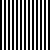 |

## Quantize

-This function attempts to quantize an image to the number of bits inputted by the user. I created a helper function that maps the input image pixel intensities to the quantized pixel intensities. Thus for example if we have 2 bits we only have 0, 85, 170, 255 for available intensities. We will map our input pixel intensities to one of those values.

| 1                                   | 2                                   | 4                                   |
| ----------------------------------- | ----------------------------------- | ----------------------------------- |
| 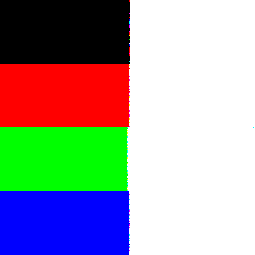 | 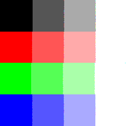 | 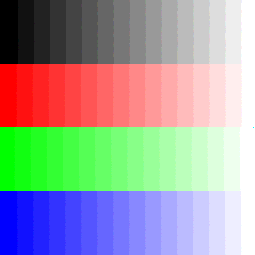 |

## Random Dither

-This function attempts to solve possible pixel rounding errors quantize has by adding some random noise to the image to affect the quantize rounding.

| 1                                     | 2                                     | 4                                     |
| ------------------------------------- | ------------------------------------- | ------------------------------------- |
| 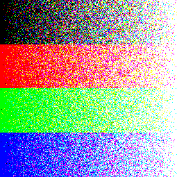 | 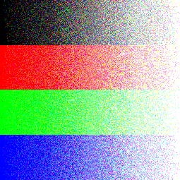 | 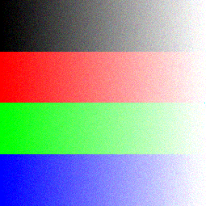 |

## Ordered Dither 2x2

-This function uses a 2x2 threshold matrix and tries to determine whether or not to round up or round down a pixel intensity based on the index of the pixel within the matrix(i = x mod n, j = y mod n) and then finding the fractional component and checking whether or not the fractional component is greater than D_2(i, j)/n^2 + 1 in order to decide whether or not to round up or down the pixel intensity.

| 1                                       | 2                                       | 4                                       |
| --------------------------------------- | --------------------------------------- | --------------------------------------- |
| 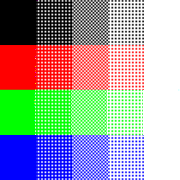 | 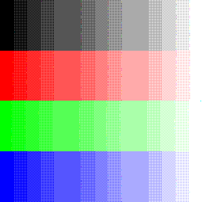 |  |

## Floyd Steinberg Dither

-This function tries to spread the quantization error by using the Floyd-Steinberg Method in which the error is dispersed to the neighboring pixels to the right of the current pixel and below. 

| 1                                    | 2                                    | 4                                    |
| ------------------------------------ | ------------------------------------ | ------------------------------------ |
| 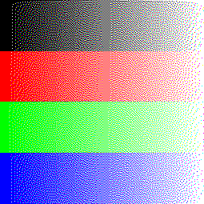 | 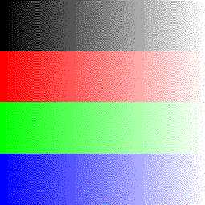 | 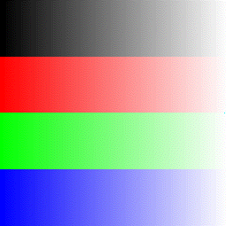 |

## Blur 3x3

-This function blurs an image by convoluting a filter [(1/16, 2/16, 1/16), (2/16, 4/16, 2/16), (1/16, 2/16, 1/16)] across the entire image.

| Blur                              |
| --------------------------------- |
| 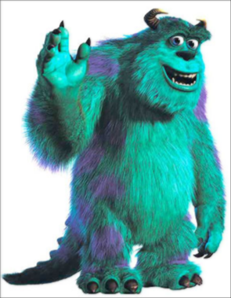 |

## Edge Detect 3x3

-This function detects only the edges of an image by convoluting a filter [(-1, -1, -1), (-1, 8, -1), (-1, -1, -1)] across the entire image.

| 0.5                               |
| --------------------------------- |
|  |

## Nearest Sample

-This function returns the value of the pixel in the original image that is closest to the inputted position x, y.

## Bilinear Sample

-This function returns the value of the pixel in the original image that is obtained by interpolating the values of the 4 pixels around the inputted position x, y.

## Gaussian Sample

-This function returns the weighted average of all the pixels within the specified radius of an inputted x, y using Gaussian weighting. It is given a specified radius and variance.

## Scale Nearest

-This function tries to scale an image and resample using nearest pixel sampling.

| 0.7                                         | 1                                         | 1.3                                         |
| ------------------------------------------- | ----------------------------------------- | ------------------------------------------- |
|  |  |  |

## Scale Bilinear

-This function tries to scale an image and resample using bilinear interpolation.

| 0.7                                             | 1                                             | 1.3                                             |
| ----------------------------------------------- | --------------------------------------------- | ----------------------------------------------- |
|  |  | 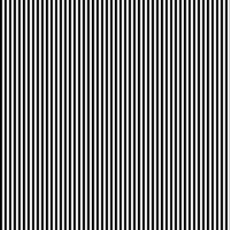 |

## Scale Gaussian

-This function tries to scale an image and resample using Gaussian Sampling. The variance is (1/scaleFactor)^2 and the radius is 3*variance.

| 0.7                                             | 1                                             | 1.3                                             |
| ----------------------------------------------- | --------------------------------------------- | ----------------------------------------------- |
| 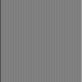 |  |  |

## Rotate Nearest

-This function tries to rotate an image an resample using nearest pixel sampling. This is done by first finding the rotated position of the left most point of the image and the highest most point in the image. Once we get that we can get the change in x and change in y from the original image and the rotated image. Now we try to   get the rotated pixel by converting our image coordinate to cartesian, adding the change in x and change in y, rotating these coordinates in the reverse angle and then converting these new coordinates into image coordinates and use the image coordinates to resample from the original image.

| 30                                       |
| ---------------------------------------- |
| 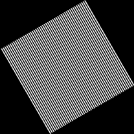 |

## Rotate Bilinear

-This function tries to rotate an image an resample using bilinear sampling. This is done by first finding the rotated position of the left most point of the image and the highest most point in the image. Once we get that we can get the change in x and change in y from the original image and the rotated image. Now we try to   get the rotated pixel by converting our image coordinate to cartesian, adding the change in x and change in y, rotating these coordinates in the reverse angle and then converting these new coordinates into image coordinates and use the image coordinates to resample from the original image.

| 30                                     |
| -------------------------------------- |
| 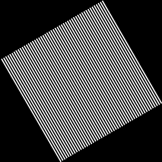 |

## Rotate Gaussian

-This function tries to rotate an image an resample using Gaussian sampling. This is done by first finding the rotated position of the left most point of the image and the highest most point in the image. Once we get that we can get the change in x and change in y from the original image and the rotated image. Now we try to   get the rotated pixel by converting our image coordinate to cartesian, adding the change in x and change in y, rotating these coordinates in the reverse angle and then converting these new coordinates into image coordinates and use the image coordinates to resample from the original image.

| 30                                        |
| ----------------------------------------- |
| 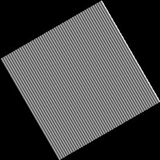 |

## Unimplemented

-Did not implement composite, setalpha, funfilter, and the  Beier-Neely Morphing section 

## Art Contest Image

Image I'm submitting to contest

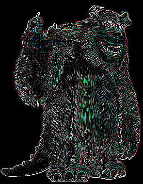

## Gif of results

Inside outputimages: contrastGif.gif

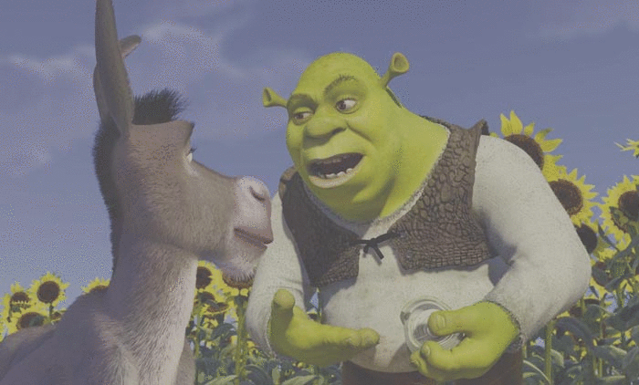