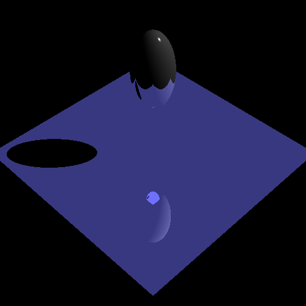

# Jason Zhang

JHEDID: jzhan127

Environment:

​	Microsoft C++ compiler

​	Visual Studio 2017

​	Windows

Late Days Used: 4

# Methods

I implemented everything up until the Reflection feature and I got:

# Art Submission

