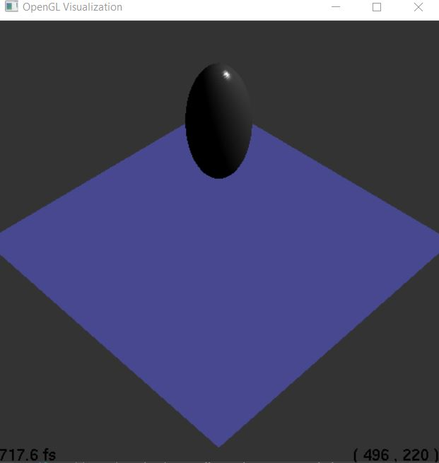
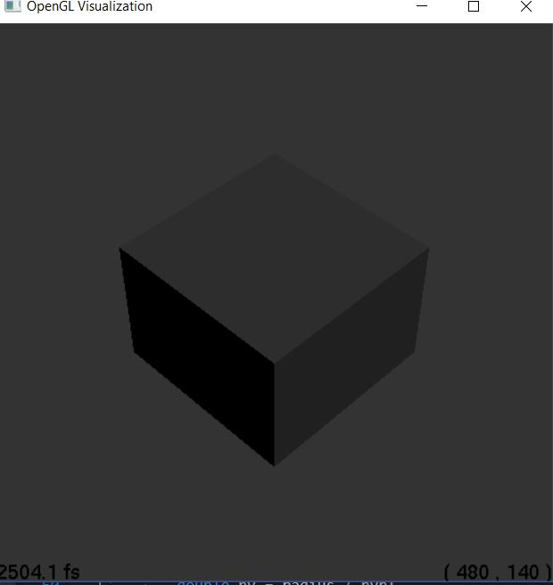
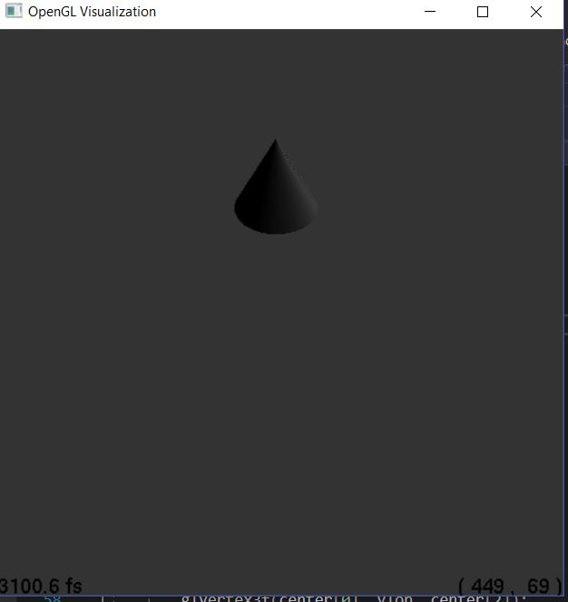
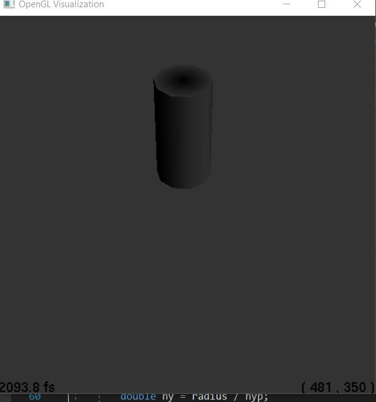
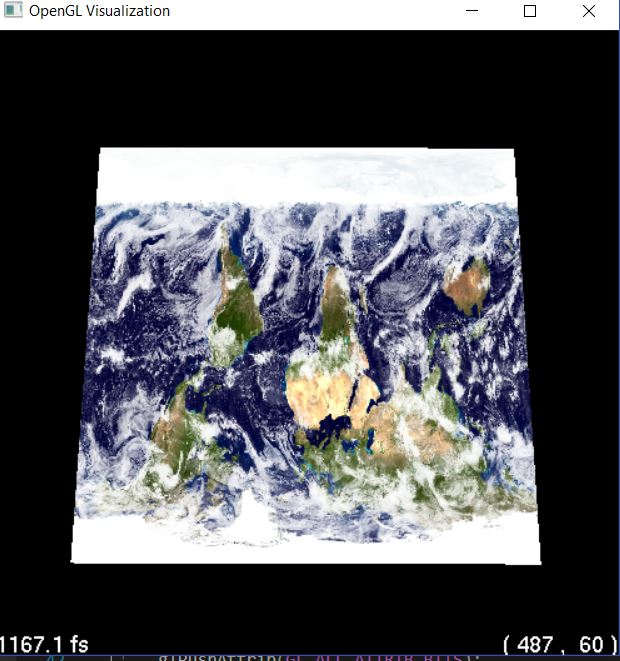
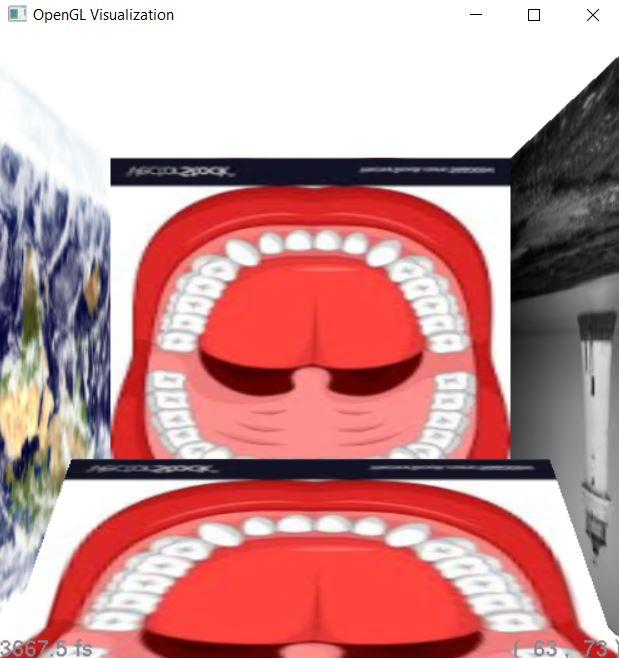
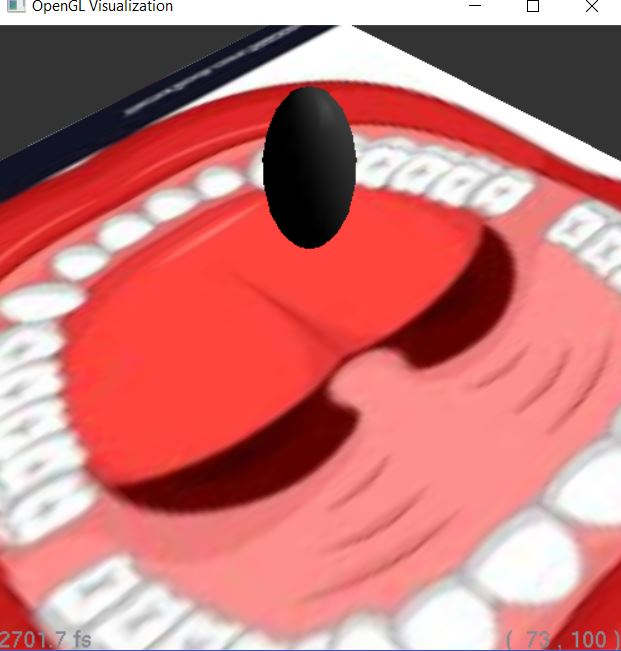

# Jason Zhang

JHEDID: jzhan127

Environment:

​	Microsoft C++ compiler

​	Visual Studio 2017

​	Windows

Late Days Used: 0

# Methods

Implemented everything up until RayCone and "Modifying drawOpenGL of subclasses such that we test if index of material associated to primitive is same as input to material index."

Images showcasing progress below:

	if (materialIndex != material->index) {
		material->drawOpenGL(glslProgram);
	}
	...
	return material->index;
	//call if materialindex differs, return last used
	/

Generated ray file with 4 walls and 3 different textures. room_texture.ray

# Art Submission

jzhan127.art.3.jpeg

jzhan127.art.3.ray

